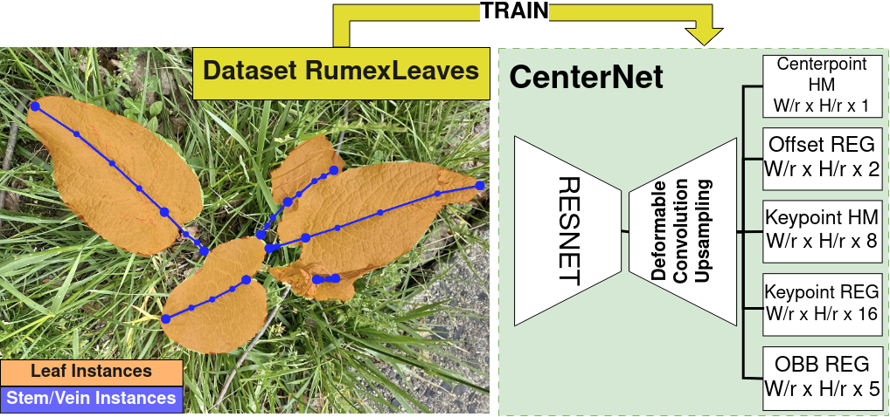

# RumexLeaves-CenterNet
This repository contains the official implementation for 
    
Zoom in on the Plant: Fine-grained Analysis of Leaf, Stem and Vein Instances. Ronja Güldenring, Rasmus Eckholdt Andersen and Lazaros Nalpantidis, IEEE Robotics and Automation Letters (RA-L), 2023

<p float="left">
  
</p>

__Abstract__:

Robot perception is far from what humans are capable of. Humans do not only have a complex semantic scene understanding but also extract fine-grained intra-object properties for the salient ones. When humans look at plants, they naturally perceive the plant architecture with its individual leaves and branching system. In this work, we want to advance the granularity in plant understanding for agricultural precision robots. We develop a model to extract fine-grained phenotypic information, such as leaf-, stem-, and vein instances. The underlying dataset \textit{RumexLeaves} is made publicly available and is the first of its kind with keypoint-guided polyline annotations leading along the line from the lowest stem point along the leaf basal to the leaf apex. Furthermore, we introduce an adapted metric POKS complying with the concept of keypoint-guided polylines. In our experimental evaluation, we provide baseline results for our newly introduced dataset while showcasing the benefits of POKS over OKS.

__Sources__:
* [RumexLeaves Website](https://dtu-pas.github.io/RumexLeaves/)
* [Publication](ToDo)
* [Dataset](https://data.dtu.dk/articles/dataset/_strong_RumexLeaves_Dataset_introduced_by_Paper_Fine-grained_Leaf_Analysis_for_Efficient_Weeding_Robots_strong_/23659524)

## Getting Started
1. Download the dataset
Download data
```
wget https://data.dtu.dk/ndownloader/files/41521812
```
2. Install pip requirements
3. Download weights
4. Run Inference 

## Note
The code will be released end of January 2024.


## Citation

If you find this work useful in your research, please cite:
```
@article{RumexLeaves-CenterNet,
author = {Güldenring, Ronja and Andersen, Rasmus Eckholdt and Nalpantidis, Lazaros},
title = {Zoom in on the Plant: Fine-grained Analysis of Leaf, Stem and Vein Instances},
journal = {IEEE Robotics and Automation Letters (RA-L)},
year = {2023}
}
```